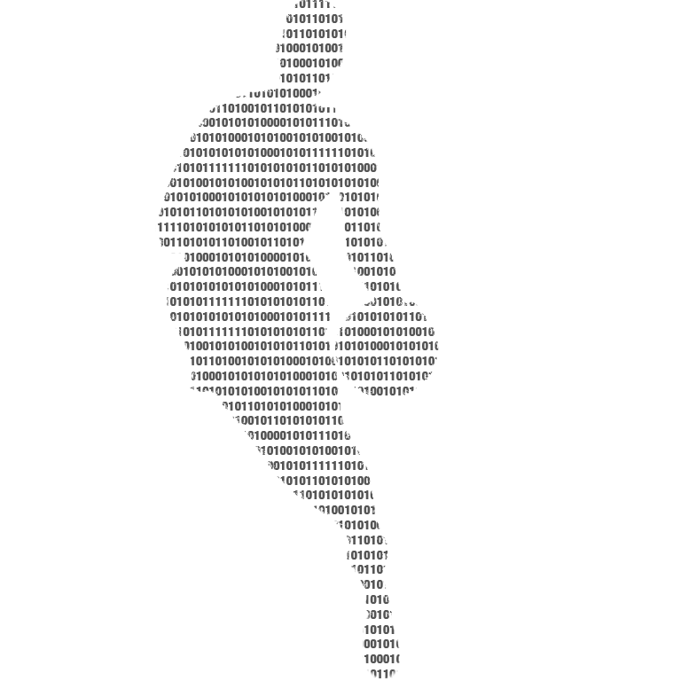

<h1 align="center">
  <a href="https://github.com/nrfrank/basketball-analytics-python-workshop">
    <!-- Please provide path to your logo here -->
    
  </a>
</h1>

  Basketball Analytics Python Workshop
   
  <a href="#about"><strong>Explore the docs »</strong></a>

   

Table of Contents

- [About](#about)
- [Getting Started](#getting-started)
  - [Prerequisites](#prerequisites)
  - [Installation](#installation)
- [Usage](#usage)
- [License](#license)
- [Acknowledgements](#acknowledgements)

---

## About

This repository provides materials for the "Basketball Analytics with Python" workshop at the 
[2022 Basketball Analytics Summit](https://www.basketballanalyticssummit.com/).

## Getting Started

### Prerequisites

This project requires a working Python installation and was developed using Python 3.9. A Python installation for your
environment can be downloaded from [Python downloads](https://www.python.org/downloads/) page. The 
[Python Beginner's Guide](https://wiki.python.org/moin/BeginnersGuide/Download) provides more detailed instructions. 
Alternatively, the [conda](https://docs.conda.io/projects/conda/en/latest/user-guide/install/index.html) package, dependency, and environment manager is a popular choice to ease the installation
and management process.

### Installation

To get started with this workshop, clone the project locally.

    > git clone https://github.com/nrfrank/basketball-analytics-python-workshop.git

Then follow the [usage](#usage) documentation.

## Usage

> **[?]**
> How does one go about using it?
> Provide various use cases and code examples here.

## License

This project is licensed under the **GNU General Public License v3**.

See [LICENSE](LICENSE) for more information.

## Acknowledgements

> **[?]**
> If your work was funded by any organization or institution, acknowledge their support here.
> In addition, if your work relies on other software libraries, or was inspired by looking at other work, it is appropriate to acknowledge this intellectual debt too.
